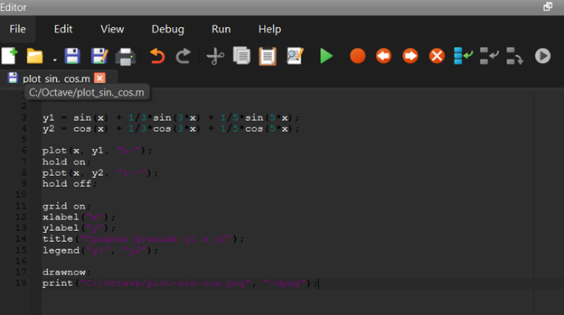
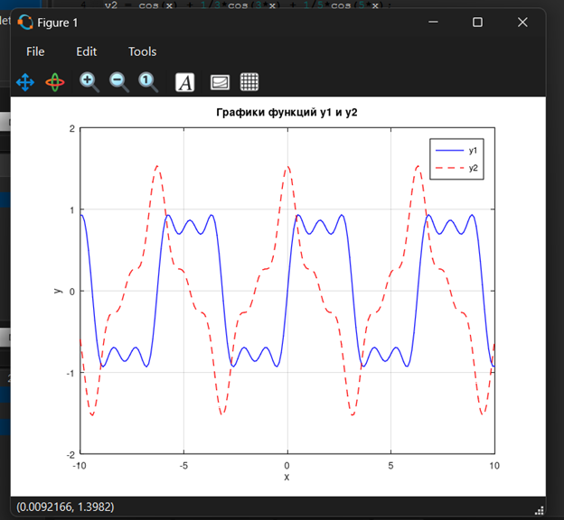
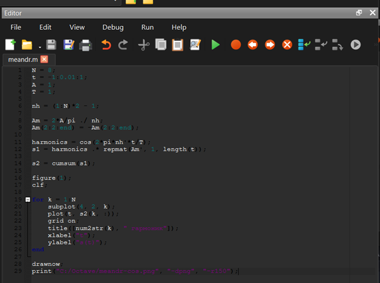
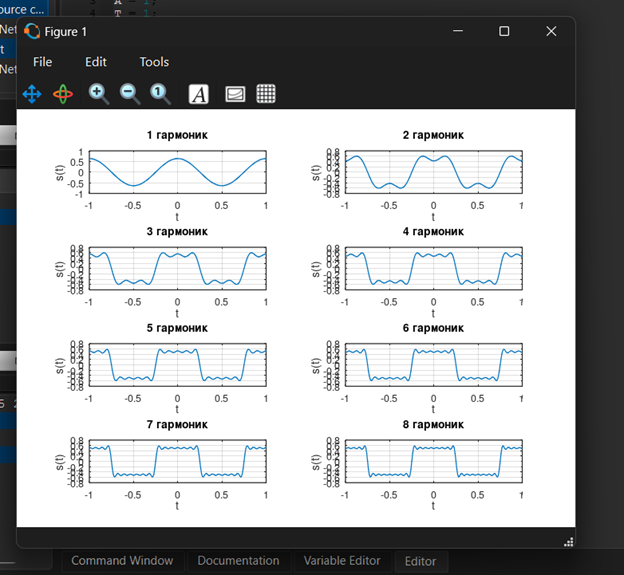
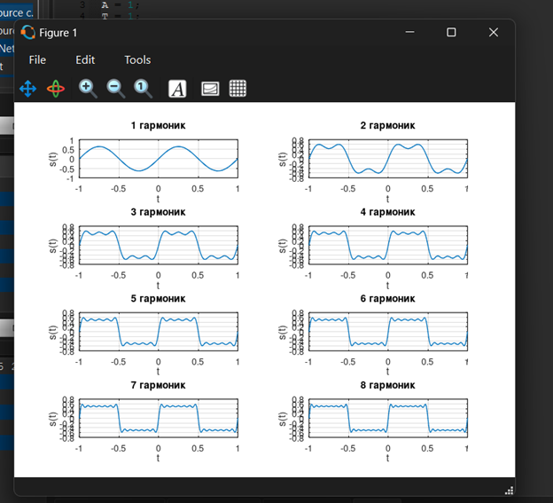
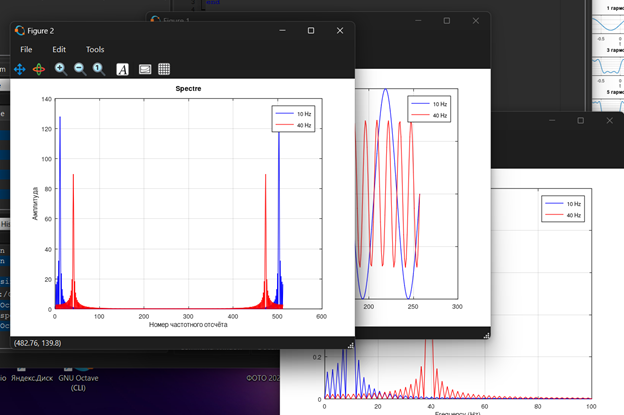
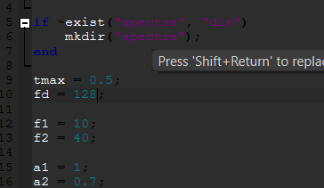
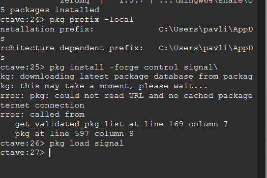
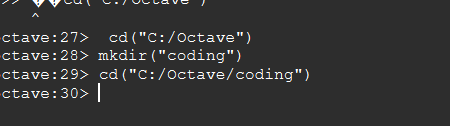

---
author:
  name: Павличенко Родион Андреевич
  email: 1132246838@rudn.ru
  affiliation:
    - name: Российский университет дружбы народов им. Патриса Лумумбы
      city: Москва
      country: Российская Федерация
title: "Домашняя работа № 1"
subtitle: "Методы кодирования и модуляция сигналов"
date: today
date-format: "YYYY-MM-DD"

format:
  beamer:
    pdf-engine: lualatex
    aspectratio: 169
    theme: default
    colortheme: default
    slide-level: 2
    toc: false
    number-sections: false
    incremental: false

    mainfont: "DejaVu Sans"
    sansfont: "DejaVu Sans"
    monofont: "DejaVu Sans Mono"

    latex-auto-install: false
    latex-tinytex: false

    include-in-header:
      text: |
        \setbeamercolor{normal text}{fg=black,bg=white}
        \setbeamercolor{structure}{fg=black}
        \setbeamercolor{title}{fg=black}
        \setbeamercolor{subtitle}{fg=black}
        \setbeamercolor{author}{fg=black}
        \setbeamercolor{date}{fg=black}
        \setbeamercolor{frametitle}{fg=black,bg=white}
        \setbeamercolor{itemize item}{fg=black}
        \setbeamercolor{itemize subitem}{fg=black}
        \setbeamercolor{enumerate item}{fg=black}
        \setbeamercolor{block title}{fg=black,bg=white}
        \setbeamercolor{block body}{fg=black,bg=white}
---

# Информация

## Докладчик

**Павличенко Родион Андреевич**

- студент Российского университета дружбы!\- народов;
- группа НПИбд-02-24;
- электронная почта: 1132246838@rudn.ru;
- дисциплина: «Сетевые технологии».

# Цель и задачи

## Цель работы

Изучить методы построения, кодирования и модуляции сигналов в GNU Octave.

Определить спектр и параметры сигналов, рассмотреть амплитудную модуляцию и исследовать свойства самосинхронизации различных способов кодирования.

## Основные задачи

- построить графики тригонометрических функций;
- выполнить разложение меандра в ряд Фурье;
- определить спектры сигналов;
- проверить влияние частоты дискретизации;
- смоделировать амплитудную модуляцию;
- реализовать несколько способов линейного кодирования;
- исследовать самосинхронизацию кодов.

# Построение графиков

## Запуск GNU Octave

Для выполнения работы была установлена и запущена среда GNU Octave.

В программе был выбран рабочий каталог для хранения сценариев и полученных изображений.

{width=76% fig-align="center"}

## Создание первого сценария

В редакторе был создан сценарий для построения функции:

$$
y_1=\sin x+\frac{1}{3}\sin 3x+\frac{1}{5}\sin 5x.
$$

После запуска сценария был получен график суммы трёх синусоидальных гармоник.

::: columns
::: {.column width="50%"}

**Программный код**

{width=92%}

:::
::: {.column width="50%"}

**Полученный график**

{width=92%}

:::
:::

## Добавление второй функции

В сценарий была добавлена функция:

$$
y_2=\cos x+\frac{1}{3}\cos 3x+\frac{1}{5}\cos 5x.
$$

Обе функции были построены в одной системе координат линиями разного типа.

::: columns
::: {.column width="50%"}

**Изменённый сценарий**

{width=92%}

:::
::: {.column width="50%"}

**Графики двух функций**

{width=92%}

:::
:::

# Разложение в ряд Фурье

## Создание сценария меандра

В сценарии `meandr.m` были заданы:

- количество гармоник;
- диапазон времени;
- амплитуда сигнала;
- период сигнала;
- коэффициенты ряда Фурье.

{width=76% fig-align="center"}

## Построение меандра

В результате были получены графики меандра с различным количеством гармоник.

При увеличении количества гармоник форма сигнала становится ближе к прямоугольной.

{width=72% fig-align="center"}

## Разложение через синусы

Сценарий был изменён для построения меандра через синусоидальные составляющие.

В разложении использовались только нечётные гармоники с постепенно уменьшающимися амплитудами.

::: columns
::: {.column width="50%"}

**Изменённый сценарий**

{width=92%}

:::
::: {.column width="50%"}

**Результат выполнения**

{width=92%}

:::
:::

## Результат разложения

Увеличение количества нечётных гармоник улучшает приближение прямоугольного сигнала.

Около точек разрыва сохраняются колебания, связанные с эффектом Гиббса.

# Спектральный анализ

## Подготовка каталога spectre1

Для определения спектров был создан каталог `spectre1`.

В нём был подготовлен сценарий `spectre.m` для работы с двумя синусоидальными сигналами.

{width=72% fig-align="center"}

## Сигналы и их спектры

Были заданы два сигнала:

- первый сигнал — частота 10 Гц, амплитуда 1;
- второй сигнал — частота 40 Гц, амплитуда 0,7.

Спектры были вычислены с помощью быстрого преобразования Фурье.

{width=78% fig-align="center"}

## Быстрое преобразование Фурье

Функция `fft` преобразует представление сигнала из временной области в частотную.

На исправленном графике спектра видны пики на частотах 10 Гц и 40 Гц. Эти пики соответствуют частотам исходных сигналов.

# Частота дискретизации

## Проверка теоремы Котельникова

Частота дискретизации была изменена с 512 Гц на 128 Гц.

Для корректного представления сигнала частотой 40 Гц должно выполняться условие:

$$
f_d>2f_{\max}.
$$

В данном случае:

$$
128>2\cdot40.
$$

{width=66% fig-align="center"}

## Что произойдёт при частоте меньше 80 Гц

При частоте дискретизации меньше 80 Гц условие теоремы Котельникова нарушается.

Возникает алиасинг — наложение спектров. Сигнал частотой 40 Гц может отображаться как сигнал с другой, более низкой частотой.

Восстановить исходный сигнал без искажений в этом случае невозможно.

# Сумма сигналов

## Спектр суммы сигналов

Был создан каталог `spectr_sum` и сценарий `spectre_sum.m`.

В сценарии вычислялась сумма сигналов с частотами 10 Гц и 40 Гц, после чего определялся её спектр.

{width=76% fig-align="center"}

## Результат спектрального анализа

В спектре суммы присутствуют две основные частотные составляющие:

- 10 Гц;
- 40 Гц.

Результат соответствует свойству линейности преобразования Фурье: спектр суммы сигналов равен сумме спектров исходных сигналов.

# Амплитудная модуляция

## Подготовка сценария модуляции

Для моделирования амплитудной модуляции был создан каталог `modulation` и сценарий `am.m`.

{width=70% fig-align="center"}

## Амплитудно-модулированный сигнал

Информационный сигнал имел частоту 5 Гц, а несущий сигнал — 50 Гц.

Амплитудно-модулированный сигнал был получен перемножением информационного и несущего сигналов.

{width=78% fig-align="center"}

## Спектр модулированного сигнала

В спектре появились две боковые составляющие:

$$
f_{\text{нижняя}}=50-5=45\ \text{Гц},
$$

$$
f_{\text{верхняя}}=50+5=55\ \text{Гц}.
$$

Таким образом, спектр произведения сигналов представляет собой свёртку их спектров.

# Кодирование сигналов

## Установка пакета signal

Для реализации способов кодирования был установлен и подключён пакет `signal`.

Он предоставляет функции, необходимые для дискретизации и обработки сигналов.

{width=72% fig-align= center}

## Подготовка каталога coding

Для файлов программы был создан каталог `coding`.

В нём были размещены главный сценарий и отдельные функции кодирования.

{width=70% fig-align="center"}

## Файлы программы

В каталоге были созданы следующие файлы:

- `main.m` и `maptowave.m`;
- `unipolar.m` и `ami.m`;
- `bipolarnrz.m` и `bipolarrz.m`;
- `manchester.m` и `diffmanc.m`;
- `calcspectre.m`.

{width=76% fig-align="center"}

## Запуск главного сценария

После запуска `main.m` были созданы 18 изображений:

- шесть графиков кодированных сигналов;
- шесть графиков для проверки самосинхронизации;
- шесть графиков спектров.

{width=76% fig-align="center"}

# Сравнение кодов

## Униполярный код и NRZ

**Униполярный код**

Единица представляется положительным уровнем, а ноль — нулевым. При длинной последовательности одинаковых битов переходы отсутствуют, поэтому самосинхронизация не обеспечивается.

**NRZ**

Ноль и единица представлены двумя постоянными уровнями. При длинной последовательности одинаковых битов уровень не изменяется, поэтому синхронизация может быть потеряна.

## Код AMI

Нулевой бит представляется нулевым уровнем.

Единицы поочерёдно кодируются положительными и отрицательными импульсами.

Переходы присутствуют при передаче единиц, однако длинная последовательность нулей не содержит переходов. Поэтому AMI не всегда обеспечивает самосинхронизацию.

## Коды RZ и Manchester

**RZ**

Сигнал возвращается к нулевому уровню внутри каждого битового интервала. Благодаря регулярным переходам код обладает самосинхронизацией.

**Manchester**

В середине каждого битового интервала обязательно происходит изменение уровня. Этот переход позволяет поддерживать синхронизацию передатчика и приёмника.

## Дифференциальный Manchester

В дифференциальном манчестерском коде переход уровня обязательно происходит в середине каждого битового интервала.

Значение бита определяется наличием или отсутствием дополнительного перехода в начале интервала.

Код обладает хорошей самосинхронизацией и устойчив к изменению полярности сигнала.

# Результаты

## Полученные результаты

- построены графики тригонометрических функций;
- выполнено разложение меандра в ряд Фурье;
- получены спектры отдельных сигналов и их суммы;
- проверено условие теоремы Котельникова;
- рассмотрено возникновение алиасинга;
- смоделирована амплитудная модуляция;
- реализованы шесть способов линейного кодирования;
- исследованы свойства самосинхронизации кодов.

# Выводы

## Итоги работы

В ходе работы были изучены методы построения, кодирования и модуляции сигналов в GNU Octave.

При увеличении количества нечётных гармоник форма частичного ряда Фурье приближается к меандру. С помощью быстрого преобразования Фурье были определены спектры сигналов с частотами 10 Гц и 40 Гц.

Установлено, что для сигнала частотой 40 Гц частота дискретизации должна быть больше 80 Гц. При нарушении этого условия возникает алиасинг.

В результате исследования линейных кодов установлено, что RZ, манчестерский и дифференциальный манчестерский коды обладают свойством самосинхронизации.

# Завершение

## Спасибо за внимание

\begin{center}

\vspace{1.5cm}

{\LARGE\bfseries Спасибо за внимание!}

\vspace{1cm}

{\large Павличенко Родион Андреевич}

{\large НПИбд-02-24}

\end{center}
