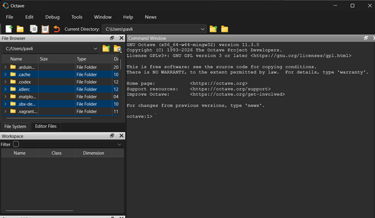
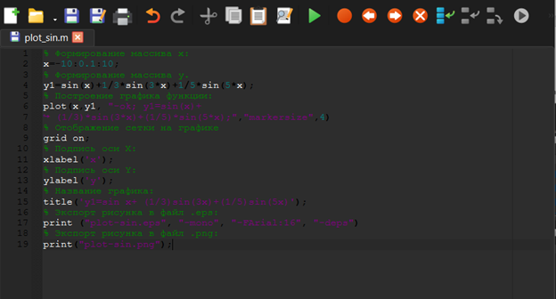
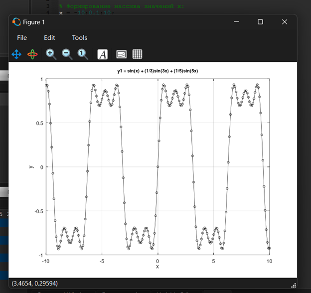
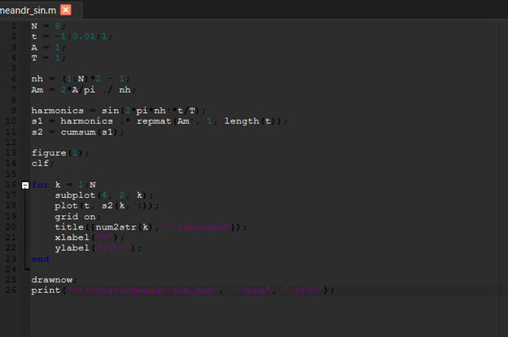
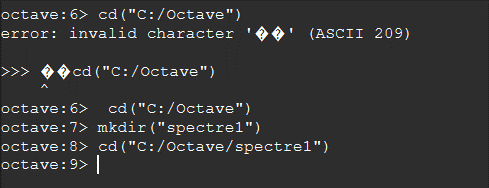
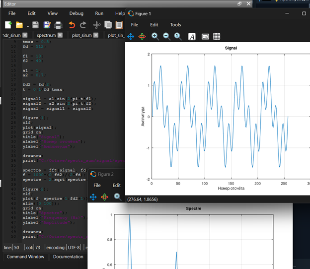
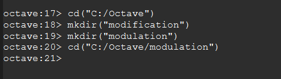
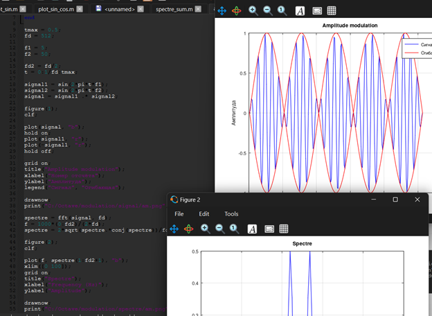
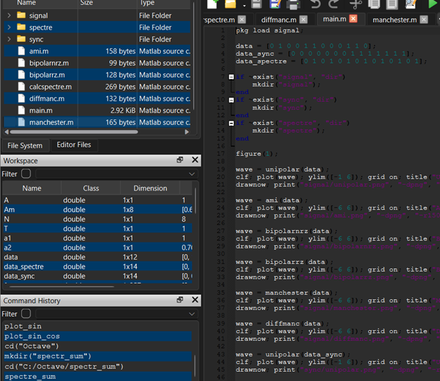
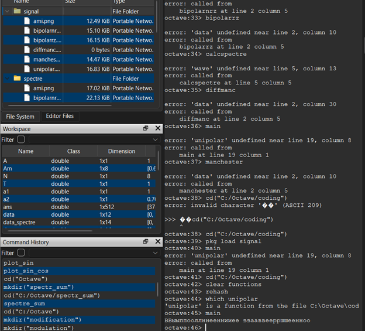

```{=latex}
\begin{titlepage}
\thispagestyle{fancy}

\begin{center}

{\large Российский университет дружбы народов имени Патриса Лумумбы}

\vspace{3cm}

{\LARGE\bfseries ОТЧЁТ}

\vspace{0.3cm}

{\LARGE\bfseries по домашней работе № 1}

\vspace{0.8cm}

{\LARGE\bfseries Методы кодирования и модуляция сигналов}

\vspace{2.5cm}

\renewcommand{\arraystretch}{1.6}

\begin{tabularx}{\textwidth}{
    >{\bfseries\columncolor{tableblue}}p{0.25\textwidth}
    X
}
Дисциплина &
Сетевые технологии \\

Выполнил &
Павличенко Родион Андреевич, НПИбд-02-24 \\

E-mail &
1132246838@rudn.ru \\
\end{tabularx}

\vfill

{\large Москва 2026}

\end{center}
\end{titlepage}

\setcounter{page}{2}
```

# Цель работы

Изучить методы построения, кодирования и модуляции сигналов с помощью языка программирования GNU Octave, определить спектр и параметры сигналов, продемонстрировать принцип амплитудной модуляции и исследовать свойства самосинхронизации различных способов линейного кодирования.

# Задание

1. Установить и запустить среду GNU Octave.
2. Построить графики тригонометрических функций и сохранить полученные изображения.
3. Выполнить разложение импульсного сигнала в частичный ряд Фурье.
4. Определить спектры двух синусоидальных сигналов и их суммы.
5. Исследовать влияние частоты дискретизации на представление сигнала.
6. Продемонстрировать принцип амплитудной модуляции.
7. Реализовать униполярное кодирование, AMI, NRZ, RZ, манчестерское и дифференциальное манчестерское кодирование.
8. Исследовать свойства самосинхронизации и спектры полученных сигналов.

# Теоретические сведения

Сигнал представляет собой физическую величину, содержащую определённую информацию. Аналоговый сигнал изменяется непрерывно, а цифровой сигнал представляется последовательностью дискретных значений.

Периодический сигнал произвольной формы можно представить в виде суммы синусоидальных составляющих. Совокупность этих составляющих называется спектром сигнала. Для определения спектра применяется преобразование Фурье. В GNU Octave его можно вычислить с помощью функции `fft`.

Согласно теореме Котельникова, для восстановления сигнала без потери информации частота дискретизации должна быть строго больше удвоенной максимальной частоты исходного сигнала:

$$
f_d > 2f_{\max}.
$$

Если это условие нарушается, возникает наложение спектров, или алиасинг. В результате исходный сигнал отображается с искажением, а его частота определяется неправильно.

Модуляция представляет собой изменение параметров несущего колебания в соответствии с передаваемым информационным сигналом. При амплитудной модуляции изменяется амплитуда несущего сигнала.

Линейное кодирование определяет способ представления битовой последовательности электрическим сигналом. Различные коды отличаются используемыми уровнями сигнала, количеством переходов и способностью сохранять синхронизацию между передатчиком и приёмником.

GNU Octave — высокоуровневый язык и программная среда для выполнения численных вычислений. Он позволяет обрабатывать массивы данных, строить графики, вычислять спектры и моделировать сигналы.

# Выполнение работы

## 1. Установка и запуск GNU Octave

На первом этапе была установлена и запущена среда GNU Octave. В рабочем окне программы доступны редактор сценариев, командное окно, список переменных и файловый обозреватель.

Для выполнения домашней работы был выбран рабочий каталог, предназначенный для хранения сценариев и полученных изображений.

{#fig-octave-start width=88%}

## 2. Создание первого сценария

В редакторе Octave был создан сценарий для построения графика функции

$$
y_1=\sin x+\frac{1}{3}\sin 3x+\frac{1}{5}\sin 5x
$$

на интервале от $-10$ до $10$.

В программе были сформированы массивы значений `x` и `y1`, задано построение графика, включена координатная сетка и добавлены подписи осей.

{#fig-first-script width=88%}

## 3. Построение первого графика

После запуска сценария был получен график заданной тригонометрической функции. Результат был сохранён в графический файл.

Форма функции определяется суммой первой, третьей и пятой гармоник синусоидального сигнала.

{#fig-sine-plot width=82%}

## 4. Добавление второй функции

Сценарий был изменён для одновременного построения двух функций:

$$
y_1=\sin x+\frac{1}{3}\sin 3x+\frac{1}{5}\sin 5x,
$$

$$
y_2=\cos x+\frac{1}{3}\cos 3x+\frac{1}{5}\cos 5x.
$$

Для различения графиков были использованы линии разного цвета и типа.

{#fig-two-functions-script width=88%}

## 5. Построение двух графиков

После выполнения изменённого сценария обе функции были построены в одной системе координат.

Полученный результат позволяет сравнить поведение сумм синусоидальных и косинусоидальных гармоник на одинаковом интервале.

{#fig-two-functions width=82%}

## 6. Создание сценария разложения меандра

Для исследования разложения импульсного сигнала в частичный ряд Фурье был создан сценарий `meandr.m`.

В сценарии были заданы количество гармоник, диапазон значений времени, амплитуда и период сигнала. Для меандра использовались нечётные гармоники, амплитуды которых уменьшаются с увеличением номера гармоники.

{#fig-meandr-script width=88%}

## 7. Построение меандра с разным количеством гармоник

В результате выполнения сценария были построены графики меандра, содержащие различное количество гармоник.

При добавлении новых гармоник форма сигнала становится ближе к прямоугольной. Около точек разрыва сохраняются колебания, связанные с эффектом Гиббса.

{#fig-meandr-result width=82%}

## 8. Реализация меандра через синусы

Сценарий был изменён для реализации разложения меандра через синусоидальные составляющие.

Как и в предыдущем варианте, в разложении использовались только нечётные гармоники с уменьшающимися амплитудами.

{#fig-meandr-sine-script width=88%}

## 9. Результат разложения через синусы

После выполнения изменённого сценария были получены графики меандра, построенного с различным количеством синусоидальных гармоник.

Увеличение количества составляющих повышает точность приближения прямоугольного импульсного сигнала.

{#fig-meandr-sine-result width=82%}

## 10. Создание каталога спектрального анализа

Для исследования спектров был создан отдельный каталог `spectre1`.

Переход в рабочий каталог был выполнен из командного окна GNU Octave. В нём был подготовлен сценарий `spectre.m`.

{#fig-spectre-directory width=82%}

## 11. Определение спектров сигналов

В сценарии были заданы два синусоидальных сигнала с частотами 10 Гц и 40 Гц и амплитудами 1 и 0,7 соответственно.

С помощью функции `fft` было выполнено быстрое преобразование Фурье. После нормировки и удаления дублирующей части спектра были получены пики на частотах исходных сигналов.

{#fig-spectre-result width=88%}

## 12. Изменение частоты дискретизации

Для исследования теоремы Котельникова частота дискретизации была изменена с 512 Гц на 128 Гц.

При частоте дискретизации 128 Гц условие для сигнала частотой 40 Гц выполняется:

$$
128 > 2\cdot40.
$$

Следовательно, оба сигнала могут быть представлены без наложения спектров.

{#fig-sampling-frequency width=82%}

Если выбрать частоту дискретизации меньше 80 Гц, условие теоремы Котельникова для сигнала частотой 40 Гц будет нарушено. В этом случае возникает алиасинг, и исходный сигнал может отображаться как сигнал с другой, более низкой частотой.

## 13. Определение спектра суммы сигналов

Для исследования суммы двух сигналов был создан каталог `spectr_sum` и сценарий `spectre_sum.m`.

В сценарии были сформированы сигналы с частотами 10 Гц и 40 Гц, вычислена их сумма, а затем определён спектр суммарного сигнала.

{#fig-spectre-sum width=88%}

Спектр суммы содержит пики на частотах обоих исходных сигналов. Полученный результат соответствует свойству линейности преобразования Фурье: спектр суммы сигналов равен сумме их спектров.

## 14. Создание каталога амплитудной модуляции

Для моделирования амплитудной модуляции был создан каталог `modulation`.

В этом каталоге был подготовлен сценарий `am.m`.

{#fig-modulation-directory width=82%}

## 15. Исследование амплитудной модуляции

В сценарии были сформированы информационный сигнал с частотой 5 Гц и несущий сигнал с частотой 50 Гц.

Амплитудно-модулированный сигнал был получен в результате перемножения информационного и несущего сигналов. Дополнительно были построены огибающая и спектр результата.

{#fig-amplitude-modulation width=88%}

В спектре модулированного сигнала появились боковые составляющие. Их частоты определяются суммой и разностью частот несущего и информационного сигналов:

$$
f_{\text{нижняя}}=50-5=45\ \text{Гц},
$$

$$
f_{\text{верхняя}}=50+5=55\ \text{Гц}.
$$

## 16. Установка пакета signal

Для реализации способов кодирования был проверен список установленных пакетов GNU Octave.

После установки пакет `signal` был загружен командой `pkg load signal`. Этот пакет необходим для использования функций обработки и дискретизации сигналов.

{#fig-signal-package width=82%}

## 17. Создание каталога coding

Для размещения программ кодирования был создан отдельный каталог `coding`.

После создания каталога был выполнен переход в него из командного окна Octave.

{#fig-coding-directory width=82%}

## 18. Создание функций кодирования

В каталоге `coding` были созданы следующие файлы:

- `main.m`;
- `maptowave.m`;
- `unipolar.m`;
- `ami.m`;
- `bipolarnrz.m`;
- `bipolarrz.m`;
- `manchester.m`;
- `diffmanc.m`;
- `calcspectre.m`.

Каждый файл содержит отдельную функцию формирования или анализа сигнала. Главный сценарий `main.m` задаёт битовые последовательности и последовательно вызывает функции кодирования.

{#fig-coding-files width=88%}

## 19. Анализ кодированных сигналов

После запуска сценария `main.m` были сформированы графики кодированных сигналов, графики для проверки самосинхронизации и спектры сигналов.

Всего было создано 18 изображений: по шесть результатов для исходной последовательности, проверки самосинхронизации и спектрального анализа.

{#fig-coding-results width=88%}

Униполярное кодирование не обеспечивает надёжную самосинхронизацию, поскольку длинная последовательность одинаковых битов не содержит изменений уровня сигнала.

Код NRZ также не обладает самосинхронизацией при передаче длинных последовательностей одинаковых значений.

В коде AMI единицы поочерёдно представляются положительными и отрицательными импульсами. Однако длинная последовательность нулей не содержит переходов, поэтому синхронизация может быть потеряна.

Код RZ возвращается к нулевому уровню в пределах каждого битового интервала и благодаря этому обеспечивает самосинхронизацию.

Манчестерский и дифференциальный манчестерский коды имеют обязательный переход уровня в середине каждого битового интервала. Поэтому они обладают хорошими свойствами самосинхронизации.

# Выводы

В ходе выполнения домашней работы были изучены методы построения, кодирования и модуляции сигналов в среде GNU Octave.

Были построены графики тригонометрических функций и исследовано приближение импульсного сигнала частичным рядом Фурье. Установлено, что при увеличении количества нечётных гармоник форма полученного сигнала приближается к меандру.

С помощью быстрого преобразования Фурье были определены спектры синусоидальных сигналов с частотами 10 Гц и 40 Гц, а также спектр их суммы. Спектр суммарного сигнала содержит частотные составляющие обоих исходных сигналов.

Было рассмотрено влияние частоты дискретизации на представление сигнала. Для сигнала частотой 40 Гц частота дискретизации должна быть больше 80 Гц. При нарушении этого условия возникает алиасинг, который приводит к неправильному определению частоты исходного сигнала.

При моделировании амплитудной модуляции были получены модулированный сигнал, его огибающая и спектр. В спектре появились боковые составляющие с частотами 45 Гц и 55 Гц.

Также были реализованы униполярный код, AMI, NRZ, RZ, манчестерский и дифференциальный манчестерский коды. Исследование показало, что RZ, манчестерский и дифференциальный манчестерский коды обладают свойством самосинхронизации. Униполярный код и NRZ не обеспечивают надёжную синхронизацию при передаче длинных последовательностей одинаковых битов, а AMI теряет синхронизацию на длинных последовательностях нулей.

Поставленная цель работы была достигнута: получены практические навыки моделирования сигналов, определения их спектров, выполнения амплитудной модуляции и исследования способов линейного кодирования.
