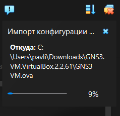
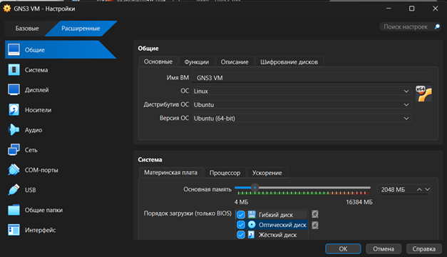
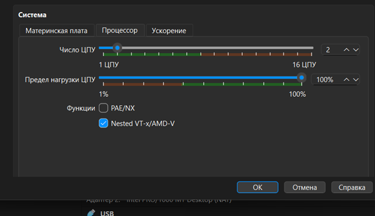
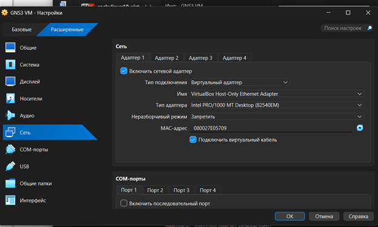
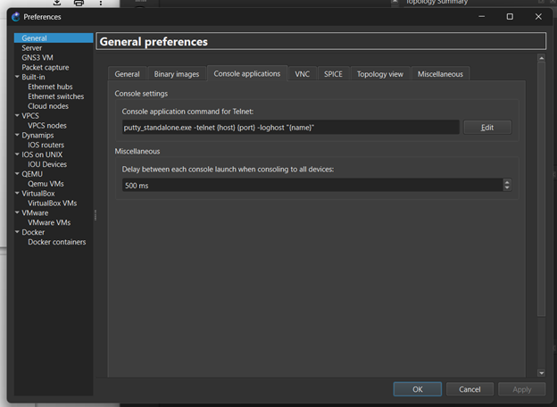
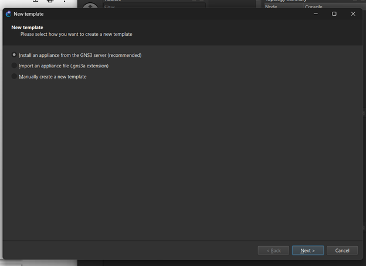
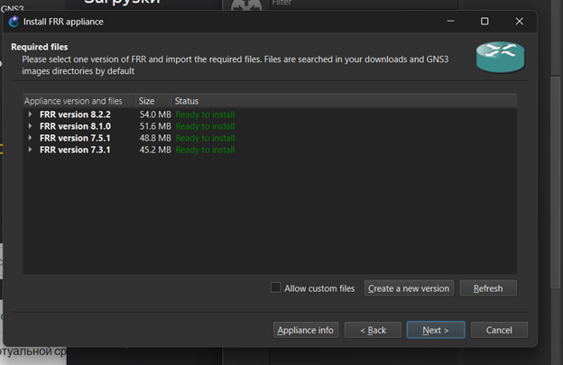
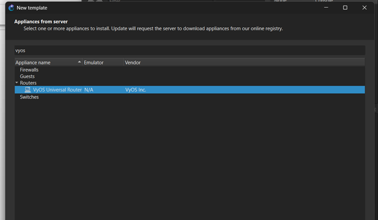

---
author:
  name: Павличенко Родион Андреевич
  email: 1132246838@rudn.ru
  affiliation:
    - name: Российский университет дружбы народов им. Патриса Лумумбы
      city: Москва
      country: Российская Федерация
title: "Лабораторная работа № 1"
subtitle: "Подготовка экспериментального стенда GNS3"
date: today
date-format: "YYYY-MM-DD"

format:
  beamer:
    pdf-engine: lualatex
    aspectratio: 169
    theme: default
    colortheme: default
    slide-level: 2
    toc: false
    number-sections: false
    incremental: false

    mainfont: "DejaVu Sans"
    sansfont: "DejaVu Sans"
    monofont: "DejaVu Sans Mono"

    latex-auto-install: false
    latex-tinytex: false

    include-in-header:
      text: |
        \setbeamercolor{normal text}{fg=black,bg=white}
        \setbeamercolor{structure}{fg=black}
        \setbeamercolor{title}{fg=black}
        \setbeamercolor{subtitle}{fg=black}
        \setbeamercolor{author}{fg=black}
        \setbeamercolor{date}{fg=black}
        \setbeamercolor{frametitle}{fg=black,bg=white}
        \setbeamercolor{itemize item}{fg=black}
        \setbeamercolor{itemize subitem}{fg=black}
        \setbeamercolor{enumerate item}{fg=black}
        \setbeamercolor{block title}{fg=black,bg=white}
        \setbeamercolor{block body}{fg=black,bg=white}
---

# Информация

## Докладчик

**Павличенко Родион Андреевич**

- студент Российского университета дружбы народов;
- группа НПИбд-02-24;
- электронная почта: 1132246838@rudn.ru;
- дисциплина: «Сетевые технологии».

# Цель и задачи

## Цель работы

Установить и настроить GNS3 и сопутствующее программное обеспечение, а также подготовить экспериментальный стенд для выполнения последующих лабораторных работ.

## Основные задачи

- импортировать GNS3 VM в VirtualBox;
- проверить параметры виртуальной машины;
- включить Nested VT-x/AMD-V;
- настроить сетевой адаптер;
- выполнить первоначальную настройку GNS3;
- добавить образы маршрутизаторов FRR и VyOS;
- проверить работоспособность стенда.

# Ход работы

## Импорт GNS3 VM

В VirtualBox была импортирована конфигурация виртуальной машины GNS3 VM.

::: columns
::: {.column width="50%"}

**Импорт конфигурации**

{width=92%}

:::
::: {.column width="50%"}

**Проверка параметров**

{width=92%}

:::
:::

## Настройка виртуализации и сети

В настройках процессора была включена вложенная виртуализация Nested VT-x/AMD-V.

Для первого сетевого адаптера был выбран режим виртуального адаптера хоста.

::: columns
::: {.column width="50%"}

**Вложенная виртуализация**

{width=92%}

:::
::: {.column width="50%"}

**Сетевой адаптер**

{width=92%}

:::
:::

## Запуск GNS3

После проверки параметров была запущена виртуальная машина GNS3 VM.

Затем в основной операционной системе было запущено приложение GNS3.

::: columns
::: {.column width="50%"}

**Запуск GNS3 VM**

{width=92%}

:::
::: {.column width="50%"}

**Подключение к серверу**

{width=92%}

:::
:::

## Настройка GNS3

Соединение с локальным сервером GNS3 было успешно установлено.

Через меню `Edit → Preferences` были проверены параметры интерфейса и консольного приложения.

{width=68% fig-align="center"}

# Добавление устройств

## Добавление маршрутизатора FRR

В GNS3 был открыт мастер создания нового шаблона устройства.

Был выбран вариант установки appliance из списка рекомендуемых устройств на сервере GNS3.

{width=72% fig-align="center"}

## Выбор образа FRR

В списке доступных устройств был выбран маршрутизатор FRR.

После выбора версии необходимые файлы были подготовлены для установки.

{width=76% fig-align="center"}

## Настройка образа FRR

После импорта были открыты параметры шаблона FRR.

В настройках образа был выбран виртуальный диск и проверены основные параметры устройства.

{width=70% fig-align="center"}

## Добавление образа VyOS

Аналогичным образом был открыт мастер добавления нового устройства и выбран образ маршрутизатора VyOS.

{width=74% fig-align="center"}

## Подготовка проекта

После установки образов был создан новый проект GNS3.

В проект были добавлены необходимые виртуальные маршрутизаторы.

{width=76% fig-align="center"}

# Проверка стенда

## Размещение устройств

В рабочей области GNS3 были размещены маршрутизаторы FRR и VyOS.

Наличие устройств в проекте подтвердило успешное добавление их шаблонов.

{width=76% fig-align="center"}

## Запуск консоли FRR

Маршрутизатор FRR был запущен. После запуска была открыта его консоль.

{width=72% fig-align="center"}

## Проверка версии FRR

В консоли маршрутизатора была выполнена команда:

```text
show version
```

Команда вывела сведения об установленной версии FRRouting.

{width=76% fig-align="center"}

# Результаты

## Полученные результаты

- GNS3 VM импортирована и запущена в VirtualBox.
- Включена вложенная виртуализация Nested VT-x/AMD-V.
- Настроен виртуальный сетевой адаптер хоста.
-- Выполнено подключение клиентской части GNS3 к серверу.
- Добавлены шаблоны маршрутизаторов FRR и VyOS.
- Создан проект с виртуальными сетевыми устройствами.
- Проверен запуск маршрутизатора FRR.
- Командой `show version` получены сведения о версии FRRouting.

# Выводы

## Итоги работы

В ходе лабораторной работы был подготовлен экспериментальный стенд GNS3.

В VirtualBox была импортирована и настроена виртуальная машина GNS3 VM. Для неё была включена вложенная виртуализация и настроен сетевой адаптер.

После подключения GNS3 к серверной части были добавлены образы маршрутизаторов FRR и VyOS. В новом проекте были размещены виртуальные сетевые устройства.

Запуск консоли FRR и выполнение команды `show version` подтвердили работоспособность подготовленного стенда.

## {.unnumbered}

```{=latex}
\vfill

\begin{center}
{\Huge\bfseries Спасибо за внимание!}

\vspace{1cm}

{\Large Павличенко Родион Андреевич}

\vspace{0.3cm}

{\large НПИбд-02-24}
\end{center}

\vfill
```
