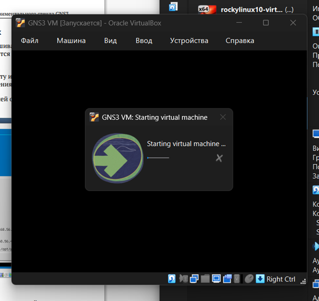
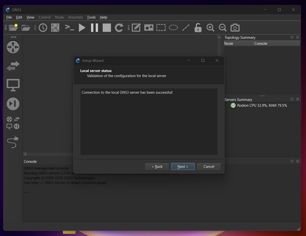
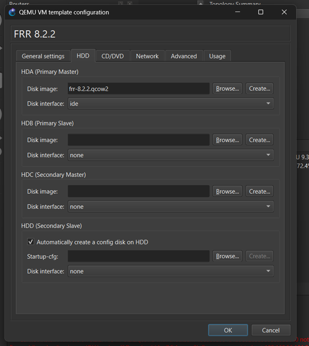
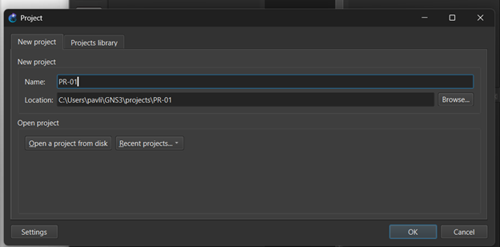
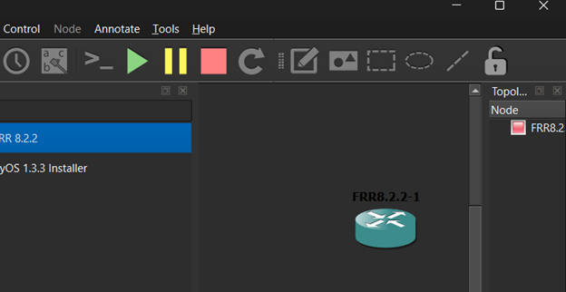
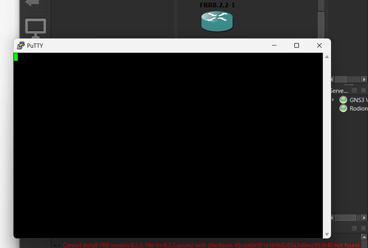
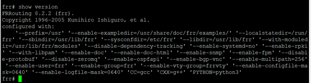

```{=latex}
\begin{titlepage}
\thispagestyle{fancy}

\begin{center}

{\large Российский университет дружбы народов имени Патриса Лумумбы}

\vspace{3cm}

{\LARGE\bfseries ОТЧЁТ}

\vspace{0.3cm}

{\LARGE\bfseries по лабораторной работе № 1}

\vspace{0.8cm}

{\LARGE\bfseries Подготовка экспериментального стенда GNS3}

\vspace{2.5cm}

\renewcommand{\arraystretch}{1.6}

\begin{tabularx}{\textwidth}{
    >{\bfseries\columncolor{tableblue}}p{0.25\textwidth}
    X
}
Дисциплина &
Сетевые технологии \\

Выполнил &
Павличенко Родион Андреевич, НПИбд-02-24 \\

E-mail &
1132246838@rudn.ru \\
\end{tabularx}

\vfill

{\large Москва 2026}

\end{center}
\end{titlepage}

\setcounter{page}{2}
```

# Цель работы

Установить и настроить GNS3 и сопутствующее программное обеспечение, а также подготовить экспериментальный стенд для выполнения последующих лабораторных работ.

# Задание

1. Установить GNS3 и импортировать виртуальную машину GNS3 VM в VirtualBox.
2. Проверить параметры виртуальной машины и исправить неправильные настройки.
3. Включить вложенную виртуализацию Nested VT-x/AMD-V.
4. Настроить сетевой адаптер виртуальной машины.
5. Запустить GNS3 VM и выполнить первоначальную настройку GNS3.
6. Импортировать образы маршрутизаторов FRR и VyOS.
7. Создать проект GNS3 и проверить работоспособность установленных устройств.

# Теоретические сведения

GNS3 — программное обеспечение для моделирования и эмуляции компьютерных сетей. Оно позволяет создавать виртуальные сетевые топологии, подключать маршрутизаторы, коммутаторы и другие устройства, а затем проверять их конфигурацию.

GNS3 состоит из графической клиентской части и серверной части. В данной работе серверная часть запускается внутри виртуальной машины GNS3 VM в VirtualBox.

Вложенная виртуализация позволяет запускать виртуальные устройства внутри другой виртуальной машины. Для этого в настройках GNS3 VM должна быть включена функция Nested VT-x/AMD-V.

FRRouting, или FRR, представляет собой программный маршрутизатор с поддержкой основных протоколов динамической маршрутизации. VyOS — специализированная операционная система на основе Linux, предназначенная для работы в качестве маршрутизатора и межсетевого экрана.

# Выполнение работы

## 1. Импорт виртуальной машины GNS3

Был загружен архив с образом GNS3 VM для VirtualBox. После распаковки образ `GNS3 VM.ova` был импортирован в VirtualBox.

{#fig-import width=78%}

## 2. Проверка параметров виртуальной машины

После импорта были открыты настройки GNS3 VM. Выполнена проверка объёма оперативной памяти, порядка загрузки и остальных параметров системы.

Сообщения о неправильных настройках виртуальной машины отсутствовали.

{#fig-vm-settings width=88%}

## 3. Настройка вложенной виртуализации

На вкладке «Процессор» была проверена функция вложенной виртуализации. Параметр `Nested VT-x/AMD-V` находился во включённом состоянии.

Вложенная виртуализация необходима для запуска сетевых устройств внутри GNS3 VM.

{#fig-nested-virtualization width=88%}

## 4. Настройка сетевого адаптера

Для первого сетевого адаптера GNS3 VM был выбран тип подключения «Виртуальный адаптер хоста».

Такое подключение обеспечивает обмен данными между основной операционной системой и GNS3 VM.

{#fig-network-adapter width=88%}

## 5. Запуск GNS3 VM

После проверки параметров виртуальная машина GNS3 VM была запущена в VirtualBox.

{#fig-gns3-vm-start width=82%}

## 6. Первоначальная настройка GNS3

После запуска приложения GNS3 был открыт мастер настройки. Соединение с локальным сервером GNS3 было успешно установлено.

Это подтвердило правильную работу клиентской и серверной частей программы.

{#fig-gns3-setup width=85%}

## 7. Настройка параметров GNS3

Через меню `Edit → Preferences` были проверены общие параметры GNS3 и настройки консольного приложения.

Параметры интерфейса и терминала были настроены для дальнейшей работы с виртуальными устройствами.

{#fig-gns3-preferences width=88%}

## 8. Добавление образа маршрутизатора FRR

В GNS3 был открыт мастер создания нового шаблона устройства. Был выбран вариант установки устройства из списка рекомендуемых appliances на сервере GNS3.

{#fig-new-template width=88%}

Для установки был выбран образ маршрутизатора FRR. В списке были доступны несколько версий образа.

{#fig-frr-version width=88%}

## 9. Настройка образа FRR

После импорта образа были открыты параметры шаблона FRR.

В настройках жёсткого диска была включена функция автоматического создания диска конфигурации. Она позволяет сохранять настройки маршрутизатора между запусками.

{#fig-frr-settings width=72%}

## 10. Добавление образа VyOS

После настройки FRR был открыт мастер добавления нового устройства. В списке маршрутизаторов выбран шаблон `VyOS Universal Router`.

{#fig-vyos-template width=88%}

## 11. Создание проекта

Для проверки работоспособности стенда был создан новый проект с именем `PR-01`.

{#fig-project width=88%}

## 12. Добавление устройств в рабочую область

В рабочую область проекта были добавлены маршрутизатор FRR и устройство VyOS.

Маршрутизатор FRR был запущен для проверки работы консоли.

{#fig-workspace width=88%}

## 13. Запуск консоли FRR

Для запущенного маршрутизатора FRR была открыта консоль PuTTY.

После загрузки устройства появилось приглашение командной строки FRR.

{#fig-frr-console width=88%}

## 14. Проверка версии FRR

В консоли была выполнена команда:

```text
show version
```

Команда вывела сведения об установленной версии FRRouting и параметрах сборки. Это подтвердило правильную установку и запуск маршрутизатора FRR.

{#fig-frr-version-check width=88%}

# Ответы на контрольные вопросы

## Для чего предназначен GNS3?

GNS3 предназначен для создания, моделирования и проверки виртуальных компьютерных сетей. С его помощью можно объединять сетевые устройства в топологии и проверять их конфигурацию без использования физического оборудования.

## Из каких компонентов состоит GNS3?

GNS3 состоит из графической клиентской части и серверной части. Клиентская часть предоставляет интерфейс для построения топологии. Серверная часть запускает виртуальные сетевые устройства и управляет ими.

# Выводы

В ходе лабораторной работы был подготовлен экспериментальный стенд GNS3 для моделирования компьютерных сетей.

В VirtualBox была импортирована и настроена виртуальная машина GNS3 VM. Были проверены параметры системы, включена вложенная виртуализация Nested VT-x/AMD-V и настроен виртуальный сетевой адаптер хоста.

После запуска GNS3 было проверено соединение с серверной частью программы. В GNS3 были импортированы и настроены образы маршрутизаторов FRR и VyOS, после чего был создан проект `PR-01`.

В рабочую область проекта был добавлен маршрутизатор FRR. Его запуск и выполнение команды `show version` подтвердили правильную установку образа и работоспособность консоли. Подготовленный стенд может использоваться для выполнения последующих лабораторных работ по сетевым технологиям.
