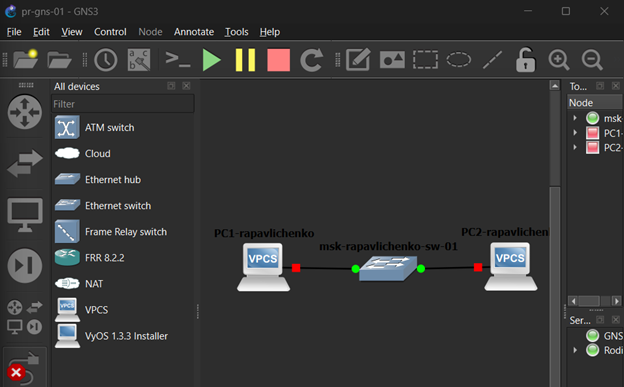
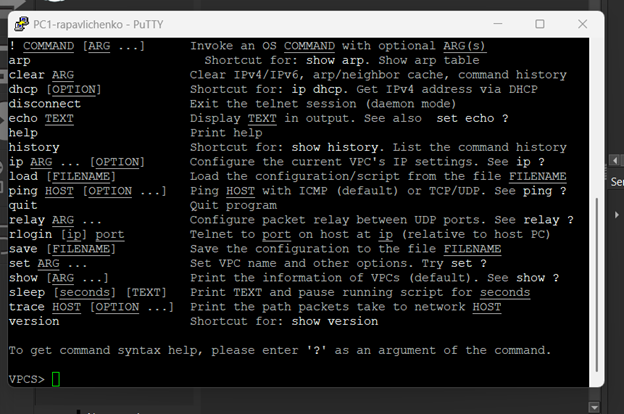
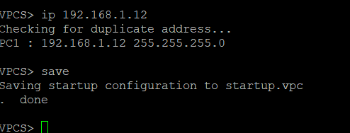
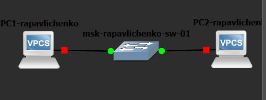
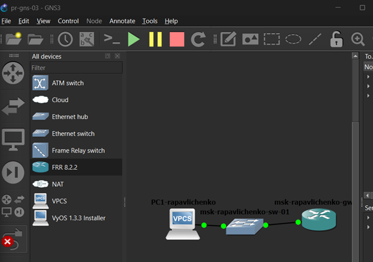
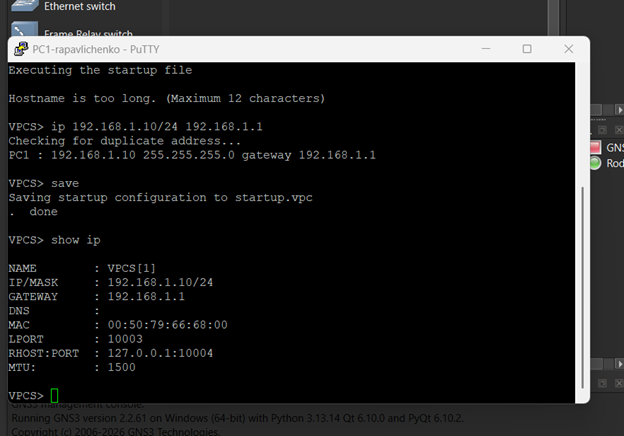
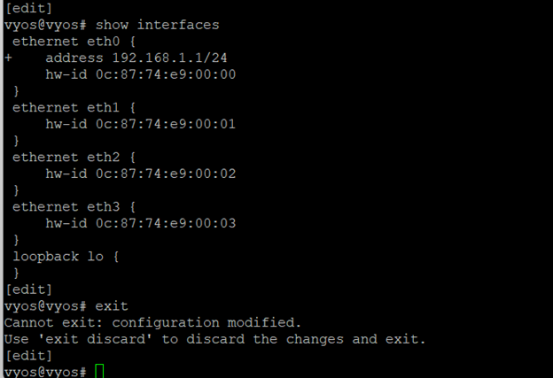
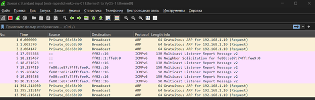

---
author:
  name: Павличенко Родион Андреевич
  email: 1132246838@rudn.ru
  affiliation:
    - name: Российский университет дружбы народов им. Патриса Лумумбы
      city: Москва
      country: Российская Федерация
title: "Лабораторная работа № 2"
subtitle: "Моделирование простых сетей в GNS3"
date: today
date-format: "YYYY-MM-DD"

format:
  beamer:
    pdf-engine: lualatex
    aspectratio: 169
    theme: default
    colortheme: default
    slide-level: 2
    toc: false
    number-sections: false
    incremental: false

    mainfont: "DejaVu Sans"
    sansfont: "DejaVu Sans"
    monofont: "DejaVu Sans Mono"

    latex-auto-install: false
    latex-tinytex: false

    include-in-header:
      text: |
        \setbeamercolor{normal text}{fg=black,bg=white}
        \setbeamercolor{structure}{fg=black}
        \setbeamercolor{title}{fg=black}
        \setbeamercolor{subtitle}{fg=black}
        \setbeamercolor{author}{fg=black}
        \setbeamercolor{date}{fg=black}
        \setbeamercolor{frametitle}{fg=black,bg=white}
        \setbeamercolor{itemize item}{fg=black}
        \setbeamercolor{itemize subitem}{fg=black}
        \setbeamercolor{enumerate item}{fg=black}
        \setbeamercolor{block title}{fg=black,bg=white}
        \setbeamercolor{block body}{fg=black,bg=white}
---

# Информация

## Докладчик

**Павличенко Родион Андреевич**

- студент Российского университета дружбы народов;
- группа НПИбд-02-24;
- электронная почта: 1132246838@rudn.ru;
- дисциплина: «Сетевые технологии».

# Цель и задачи

## Цель работы

Получить практические навыки создания простых сетевых топологий в GNS3, настройки IP-адресов сетевых устройств и анализа трафика с помощью программы Wireshark.

## Основные задачи

- создать сеть из двух компьютеров VPCS;
- настроить IP-адреса сетевых узлов;
- проверить соединение между компьютерами;
- исследовать трафик ARP, ICMP и UDP;
- создать топологию с маршрутизатором FRR;
- создать топологию с маршрутизатором VyOS;
- проанализировать передаваемые пакеты в Wireshark.

# Сеть с узлами VPCS

## Создание топологии

В GNS3 была создана топология, состоящая из двух виртуальных компьютеров VPCS и Ethernet-коммутатора.

После соединения устройств были открыты консоли виртуальных компьютеров.

::: columns
::: {.column width="50%"}

**Созданная топология**

{width=92%}

:::
::: {.column width="50%"}

**Запуск устройств**

{width=92%}

:::
:::

## Настройка IP-адресов

Первому компьютеру был назначен адрес `192.168.1.11/24`, а второму — `192.168.1.12/24`.

Оба компьютера находятся в одной подсети `192.168.1.0/24`.

::: columns
::: {.column width="50%"}

**Первый компьютер**

{width=92%}

:::
::: {.column width="50%"}

**Второй компьютер**

{width=92%}

:::
:::

## Проверка соединения

Для проверки соединения между компьютерами была использована команда `ping`.

Полученные ответы подтвердили правильность настройки сети. Затем устройствам были присвоены понятные имена.

::: columns
::: {.column width="50%"}

**Проверка соединения**

{width=92%}

:::
::: {.column width="50%"}

**Изменение имён**

{width=92%}

:::
:::

# Анализ трафика

## Запуск Wireshark

На соединении между компьютером и коммутатором был запущен захват сетевого трафика.

В Wireshark были обнаружены широковещательные пакеты Gratuitous ARP.

::: columns
::: {.column width="50%"}

**Запуск захвата**

{width=92%}

:::
::: {.column width="50%"}

**Пакеты Gratuitous ARP**

{width=92%}

:::
:::

## Анализ ICMP и UDP

При выполнении команды `ping` были зафиксированы сообщения ICMP Echo Request и ICMP Echo Reply.

Также был выполнен захват UDP-датаграмм.

::: columns
::: {.column width="50%"}

**ICMP-трафик**

{width=92%}

:::
::: {.column width="50%"}

**UDP-трафик**

{width=92%}

:::
:::

# Маршрутизатор FRR

## Создание топологии с FRR

Была создана топология из компьютера VPCS, Ethernet-коммутатора и маршрутизатора FRR.

На компьютере был настроен IP-адрес из подсети `192.168.1.0/24`.

::: columns
::: {.column width="50%"}

**Топология с FRR**

{width=92%}

:::
::: {.column width="50%"}

**Настройка VPCS**

{width=92%}

:::
:::

## Настройка маршрутизатора FRR

Интерфейсу `eth0` маршрутизатора FRR был назначен IP-адрес `192.168.1.1/24`.

После завершения настройки была просмотрена текущая конфигурация устройства.

::: columns
::: {.column width="50%"}

**Настройка интерфейса**

{width=92%}

:::
::: {.column width="50%"}

**Проверка конфигурации**

{width=92%}

:::
:::

## Проверка соединения с FRR

Между компьютером VPCS и маршрутизатором FRR был выполнен обмен пакетами.

В Wireshark были обнаружены ARP-запросы, ARP-ответы и сообщения протокола ICMP.

{width=72% fig-align="center"}

# Маршрутизатор VyOS

## Создание топологии с VyOS

Была создана топология из компьютера VPCS, Ethernet-коммутатора и маршрутизатора VyOS.

На компьютере был настроен IP-адрес из подсети `192.168.1.0/24`.

::: columns
::: {.column width="50%"}

**Топология с VyOS**

{width=92%}

:::
::: {.column width="50%"}

**Настройка VPCS**

{width=92%}

:::
:::

## Первоначальная настройка VyOS

После запуска был выполнен вход в операционную систему VyOS.

В режиме конфигурации маршрутизатору было назначено имя устройства. Затем были проверены его сетевые интерфейсы.

::: columns
::: {.column width="50%"}

**Настройка VyOS**

{width=92%}

:::
::: {.column width="50%"}

**Проверка интерфейсов**

{width=92%}

:::
:::

## Анализ трафика VyOS

На соединении между маршрутизатором VyOS и Ethernet-коммутатором был запущен захват трафика.

В Wireshark были обнаружены служебные пакеты ARP и пакеты, связанные с работой IPv6.

{width=74% fig-align="center"}

# Результаты

## Полученные результаты

- Создана топология из двух компьютеров VPCS.
- Настроены IP-адреса сетевых узлов.
- Проверено соединение между компьютерами.
- Выполнен захват трафика в Wireshark.
- Исследованы пакеты ARP, ICMP и UDP.
- Настроен сетевой интерфейс маршрутизатора FRR.
- Создана и проверена топология с маршрутизатором VyOS.
- Проанализирован обмен пакетами в созданных сетях.

# Контрольные вопросы

## Использованные протоколы

**Для чего используется ARP?**

ARP определяет MAC-адрес устройства по известному IPv4-адресу.

**Для чего используется ICMP?**

ICMP передаёт служебные сообщения и используется для проверки доступности сетевых узлов.

**Что такое Gratuitous ARP?**

Это ARP-сообщение, которое устройство отправляет без предварительного запроса для объявления соответствия своего IP-адреса и MAC-адреса.

**Для чего используется Wireshark?**

Wireshark позволяет захватывать сетевые пакеты и исследовать их содержимое.

# Выводы

## Итоги работы

В ходе лабораторной работы были созданы и настроены простые сетевые топологии в GNS3.

Для компьютеров VPCS были настроены IP-адреса и проверено соединение. С помощью Wireshark был исследован трафик протоколов ARP, ICMP и UDP.

Также были созданы топологии с маршрутизаторами FRR и VyOS. Для маршрутизаторов были настроены сетевые интерфейсы и выполнена проверка передачи данных.

В результате работы были получены практические навыки моделирования сетей, настройки сетевых устройств и анализа сетевого трафика.

## {.unnumbered}

```{=latex}
\vfill

\begin{center}
{\Huge\bfseries Спасибо за внимание!}

\vspace{1cm}

{\Large Павличенко Родион Андреевич}

\vspace{0.3cm}

{\large НПИбд-02-24}
\end{center}

\vfill
```
