```{=latex}
\begin{titlepage}
\thispagestyle{fancy}

\begin{center}

{\large Российский университет дружбы народов имени Патриса Лумумбы}

\vspace{3cm}

{\LARGE\bfseries ОТЧЁТ}

\vspace{0.3cm}

{\LARGE\bfseries по лабораторной работе № 2}

\vspace{0.8cm}

{\LARGE\bfseries Моделирование простых сетей в GNS3}

\vspace{2.5cm}

\renewcommand{\arraystretch}{1.6}

\begin{tabularx}{\textwidth}{
    >{\bfseries\columncolor{tableblue}}p{0.25\textwidth}
    X
}
Дисциплина &
Сетевые технологии \\

Выполнил &
Павличенко Родион Андреевич, НПИбд-02-24 \\

E-mail &
1132246838@rudn.ru \\
\end{tabularx}

\vfill

{\large Москва 2026}

\end{center}
\end{titlepage}

\setcounter{page}{2}
```

# Цель работы

Получить практические навыки создания простых сетевых топологий в GNS3, настройки IP-адресов сетевых устройств и анализа трафика с помощью программы Wireshark.

# Задание

1. Создать сеть из двух компьютеров VPCS и Ethernet-коммутатора.
2. Настроить IP-адреса узлов и проверить соединение между ними.
3. Выполнить захват и анализ трафика ARP, ICMP и UDP.
4. Создать сетевую топологию с маршрутизатором FRR.
5. Настроить интерфейс маршрутизатора FRR и проверить соединение с узлом VPCS.
6. Создать топологию с маршрутизатором VyOS и выполнить его первоначальную настройку.
7. Выполнить захват и анализ сетевого трафика в созданных топологиях.

# Теоретические сведения

GNS3 — программное обеспечение для моделирования и эмуляции компьютерных сетей. Оно позволяет создавать сетевые топологии, соединять виртуальные компьютеры, коммутаторы и маршрутизаторы, а затем проверять их работу.

VPCS представляет собой простой виртуальный компьютер, предназначенный для настройки IP-адресов и проверки сетевого соединения. Ethernet-коммутатор объединяет устройства в пределах одной локальной сети.

Протокол ARP используется для определения MAC-адреса устройства по известному IP-адресу. Протокол ICMP применяется для передачи служебных сообщений и проверки доступности сетевых узлов. UDP обеспечивает передачу датаграмм без предварительного установления соединения.

Wireshark — программа для захвата и анализа сетевого трафика. Она позволяет просматривать структуру пакетов, адреса отправителей и получателей, используемые протоколы и другие параметры обмена данными.

# Выполнение работы

## 1. Создание первой сетевой топологии

В рабочей области GNS3 была создана топология, состоящая из двух виртуальных компьютеров VPCS и Ethernet-коммутатора.

Устройства были соединены с коммутатором при помощи виртуальных сетевых каналов.

{#fig-vpcs-topology width=88%}

## 2. Запуск сетевых устройств

После создания топологии все устройства были запущены. Для настройки виртуальных компьютеров были открыты их консоли.

{#fig-vpcs-start width=88%}

## 3. Настройка первого компьютера

Первому виртуальному компьютеру был назначен IP-адрес `192.168.1.11` с маской сети `/24`.

В качестве шлюза был указан адрес `192.168.1.1`.

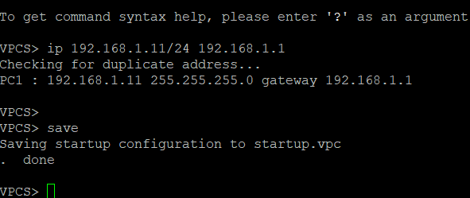{#fig-pc1-address width=88%}

## 4. Настройка второго компьютера

Второму виртуальному компьютеру был назначен IP-адрес `192.168.1.12` с маской сети `/24`.

Оба компьютера находятся в одной подсети `192.168.1.0/24`.

{#fig-pc2-address width=88%}

## 5. Проверка соединения

Для проверки соединения с первого компьютера была выполнена отправка ICMP-запросов на IP-адрес второго компьютера.

Получение ответов подтвердило правильность настройки адресов и наличие соединения между узлами.

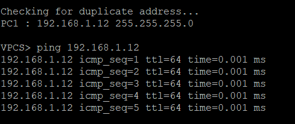{#fig-vpcs-ping width=88%}

## 6. Изменение имён устройств

Для удобства дальнейшей работы виртуальным компьютерам были присвоены понятные имена.

Изменение имён позволяет быстрее определять назначение каждого устройства в сетевой топологии.

{#fig-vpcs-names width=88%}

## 7. Запуск захвата трафика

На соединении между виртуальным компьютером и Ethernet-коммутатором был запущен захват сетевого трафика.

Полученные пакеты были открыты в программе Wireshark.

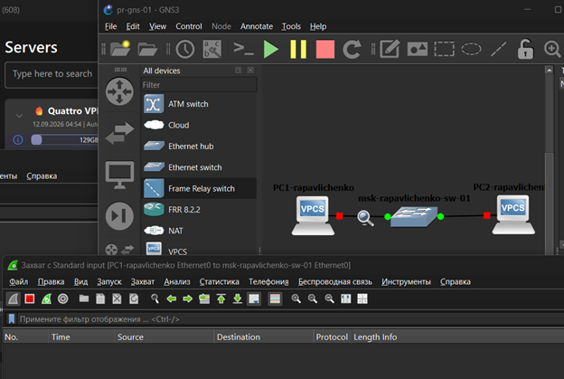{#fig-capture-start width=88%}

## 8. Анализ трафика ARP

В Wireshark были обнаружены широковещательные пакеты Gratuitous ARP.

Такие пакеты позволяют устройству сообщить другим узлам сети о соответствии своего IP-адреса MAC-адресу. Они также могут использоваться для обнаружения конфликтов IP-адресов.

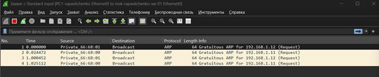{#fig-gratuitous-arp width=88%}

## 9. Анализ трафика ICMP

Между виртуальными компьютерами была повторно выполнена команда `ping`.

В захваченном трафике появились сообщения ICMP Echo Request и ICMP Echo Reply. Они соответствуют запросам и ответам, передаваемым при проверке доступности узла.

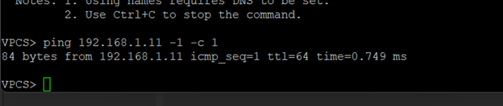{#fig-icmp-analysis width=88%}

## 10. Анализ трафика UDP

Для изучения протокола UDP между устройствами была выполнена передача UDP-пакетов.

В Wireshark были отображены IP-адреса отправителя и получателя, номера портов и длина переданных датаграмм.

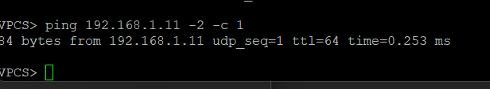{#fig-udp-analysis width=88%}

## 11. Создание топологии с маршрутизатором FRR

На следующем этапе была создана новая топология. В неё были добавлены виртуальный компьютер VPCS, Ethernet-коммутатор и маршрутизатор FRR.

Устройства были соединены виртуальными сетевыми каналами.

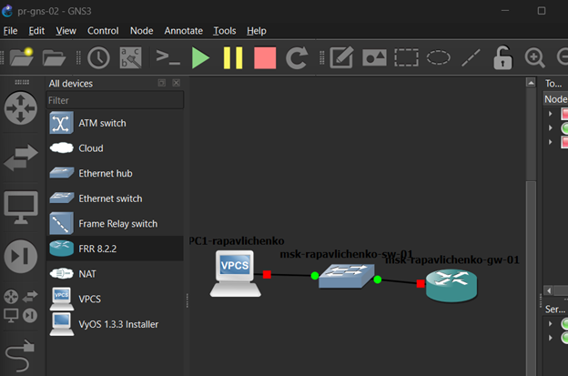{#fig-frr-topology width=88%}

## 12. Настройка компьютера в топологии с FRR

На виртуальном компьютере был настроен IP-адрес из подсети `192.168.1.0/24`.

Адрес интерфейса маршрутизатора FRR был указан в качестве шлюза.

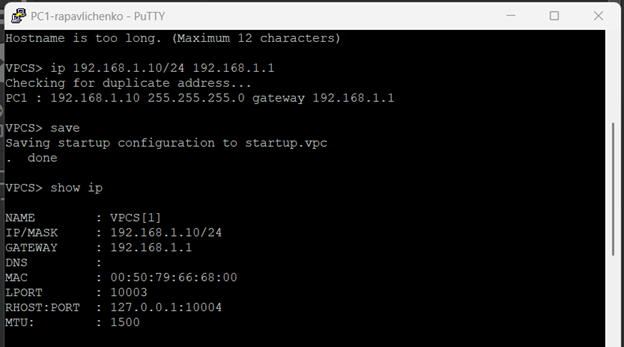{#fig-frr-vpcs-address width=88%}

## 13. Настройка интерфейса FRR

В консоли маршрутизатора FRR был выполнен переход в привилегированный режим и режим конфигурации.

Интерфейсу `eth0` был назначен IP-адрес `192.168.1.1/24`. После настройки интерфейс был включён.

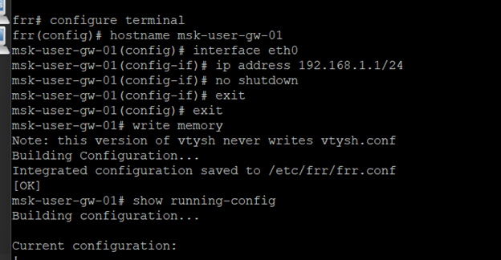{#fig-frr-interface width=88%}

## 14. Проверка конфигурации FRR

После настройки была просмотрена текущая конфигурация маршрутизатора FRR.

В конфигурации отображались параметры интерфейса и назначенный ему IP-адрес.

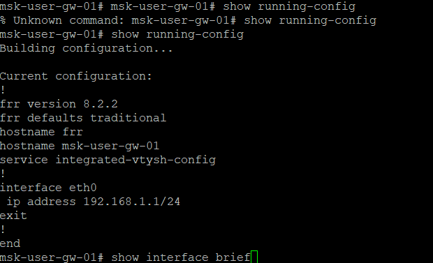{#fig-frr-config width=88%}

## 15. Анализ обмена данными с FRR

Для проверки соединения была выполнена отправка пакетов между компьютером VPCS и маршрутизатором FRR.

В Wireshark были обнаружены ARP-запросы, ARP-ответы и сообщения протокола ICMP. Полученные пакеты подтвердили наличие соединения между устройствами.

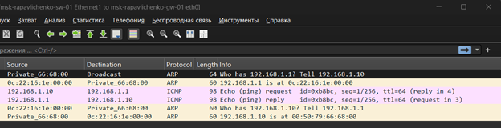{#fig-frr-traffic width=88%}

## 16. Создание топологии с маршрутизатором VyOS

На заключительном этапе была создана топология, состоящая из виртуального компьютера VPCS, Ethernet-коммутатора и маршрутизатора VyOS.

{#fig-vyos-topology width=88%}

## 17. Настройка компьютера в топологии с VyOS

На виртуальном компьютере был настроен IP-адрес из подсети `192.168.1.0/24`.

В качестве шлюза был указан адрес сетевого интерфейса маршрутизатора VyOS.

{#fig-vyos-vpcs-address width=88%}

## 18. Первоначальная настройка VyOS

После запуска маршрутизатора был выполнен вход в операционную систему VyOS.

Затем был открыт режим конфигурации и задано имя устройства. Выполненные изменения были применены и сохранены.

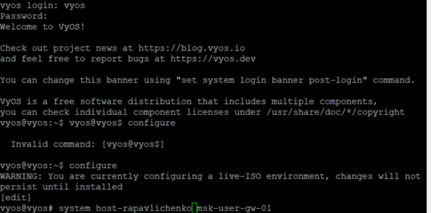{#fig-vyos-configuration width=88%}

## 19. Проверка интерфейсов VyOS

После выполнения настройки была просмотрена информация о сетевых интерфейсах маршрутизатора VyOS.

В результате проверки были определены имена интерфейсов, назначенные адреса и их текущее состояние.

{#fig-vyos-interfaces width=88%}

## 20. Анализ трафика в топологии с VyOS

На соединении между маршрутизатором VyOS и Ethernet-коммутатором был запущен захват трафика.

В программе Wireshark были обнаружены служебные пакеты ARP и пакеты, связанные с работой IPv6. Захваченные данные подтвердили передачу сетевых кадров через выбранный интерфейс.

{#fig-vyos-traffic width=88%}

# Ответы на контрольные вопросы

## Для чего используется протокол ARP?

Протокол ARP используется для определения MAC-адреса сетевого устройства по известному IPv4-адресу. Узел отправляет широковещательный ARP-запрос, а устройство с указанным IP-адресом передаёт ARP-ответ со своим MAC-адресом.

## Что такое Gratuitous ARP?

Gratuitous ARP — это ARP-сообщение, которое устройство отправляет без получения предварительного запроса. Оно используется для объявления соответствия IP-адреса MAC-адресу, обновления ARP-таблиц других устройств и обнаружения конфликтов IP-адресов.

## Для чего используется протокол ICMP?

Протокол ICMP применяется для передачи служебных сообщений о состоянии сети и возникающих ошибках. Команда `ping` использует сообщения ICMP Echo Request и ICMP Echo Reply для проверки доступности сетевого узла.

## Для чего используется Wireshark?

Wireshark используется для захвата и анализа сетевого трафика. Программа позволяет просматривать содержимое пакетов, определять используемые протоколы, адреса отправителей и получателей и исследовать последовательность обмена данными.

# Выводы

В ходе лабораторной работы были получены практические навыки создания и настройки простых сетевых топологий в GNS3.

Была создана сеть из двух виртуальных компьютеров VPCS и Ethernet-коммутатора. Компьютерам были назначены IP-адреса, после чего соединение между ними было проверено с помощью команды `ping`.

С использованием программы Wireshark был выполнен захват сетевого трафика. Были рассмотрены пакеты Gratuitous ARP, сообщения ICMP Echo Request и ICMP Echo Reply, а также UDP-датаграммы.

Дополнительно были созданы топологии с маршрутизаторами FRR и VyOS. Для маршрутизаторов были настроены сетевые интерфейсы и проверена передача данных между устройствами.

В результате выполнения работы была достигнута поставленная цель: получены навыки моделирования простых компьютерных сетей, настройки сетевых устройств и анализа передаваемого трафика.
